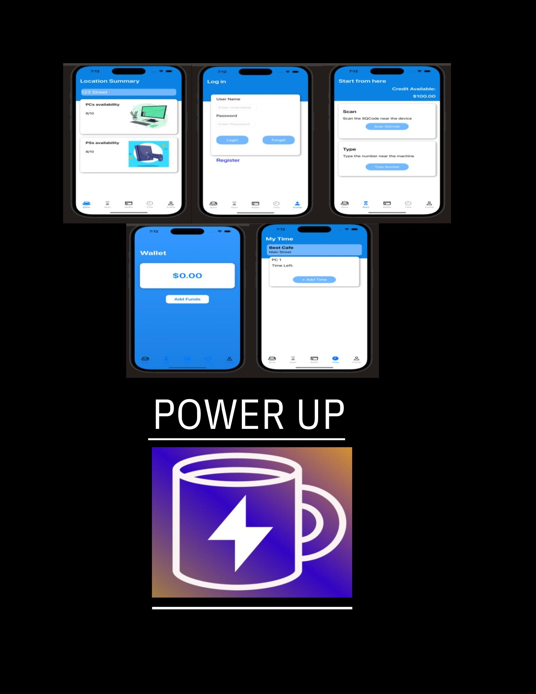

# Power Up 

Want a seamless user experience at your favorite internet cafe? 
With our PowerUp app, all this can be accomplished and more!

## Table of Contents
- [About The Project](#about-the-project)
- [Application Usage](#application-usage)
- [Starting the Application](#starting-the-application)
- [Tools Used](#tools-used)

## About The Project

  

## Starting the Application

- **First Step**: Download integrated services through the following link and open it with your Java IDE of choice https://github.com/txli299/integratedService
-  **Second Step**: Run the YAML file found in integrated services, this will allow the backend database to run
-  **Third Step**: Run the 'IntegratedServiceApplication' file on your Java IDE
-  **Fourth Step**: Go to 'localhost:8081' on your web browser which will allow you to see the user, machines, and cafe locations

## Application Usage

- Our comprehensive application provides all the tools necessary for an individual to do the following:
  - **LOCATE**: Nearest internet cafe
  - **CREATE**: Account that is associated with user
  - **WALLET**: Tracks how many funds are available to use on different machines within cafe
  - **TIME**: Tracks amount of time user has on given machine
  - **VISUALIZE**: User sees how many machines are available at given cafe
- This app provides the functionality necessary to provide users with the best possible internet/gaming cafe experience.

## Tools Used

To create this project we used the following tools:
- Swift
